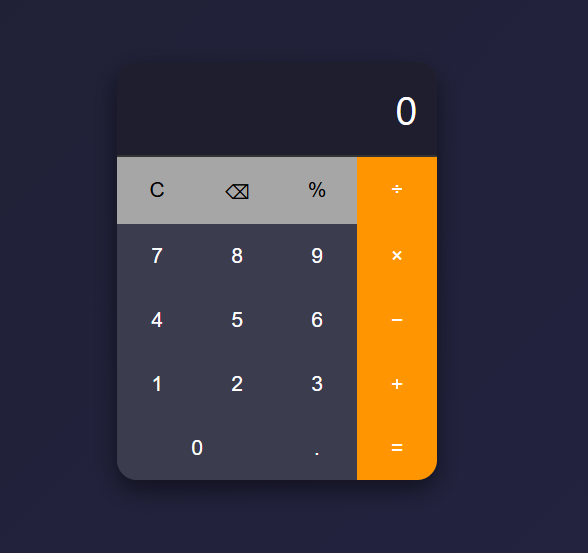

# Modern Calculator

A simple but modern calculator with a clean and stylish design.  
It supports basic mathematical operations, clear, delete, and percentage calculation.  

## Features
- Modern dark-themed design with orange accents  
- Basic operations: addition, subtraction, multiplication, division  
- Percentage calculation  
- Clear (C) and delete (⌫) buttons  
- Responsive layout with "0" button spanning two columns  

## Technologies
- HTML5  
- CSS3  
- Vanilla JavaScript  

## Preview 

